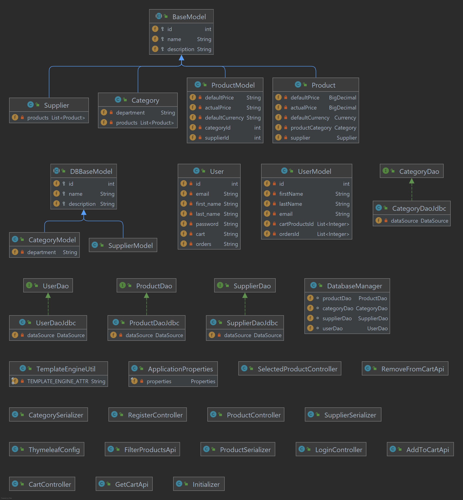

# Codecool Shop

## What is Codecool Shop?

- Codecool Shop is on online shop platform that sells electronic gadgets (laptops, smartphones, cameras, tablets etc).

## Features:

### -Implemented:

- There is a main page where all products are displayed
- Products can be sorted by Supplier and by Category
- Users can register 
- Users can add products to cart and checkout

### -Missing:

- Adding payment methods
- Supplier accounts for adding and managing products stocks

##Technologies used:

- Java Servlets
- Thymeleaf
- PostgreSQL

##Classes diagram

